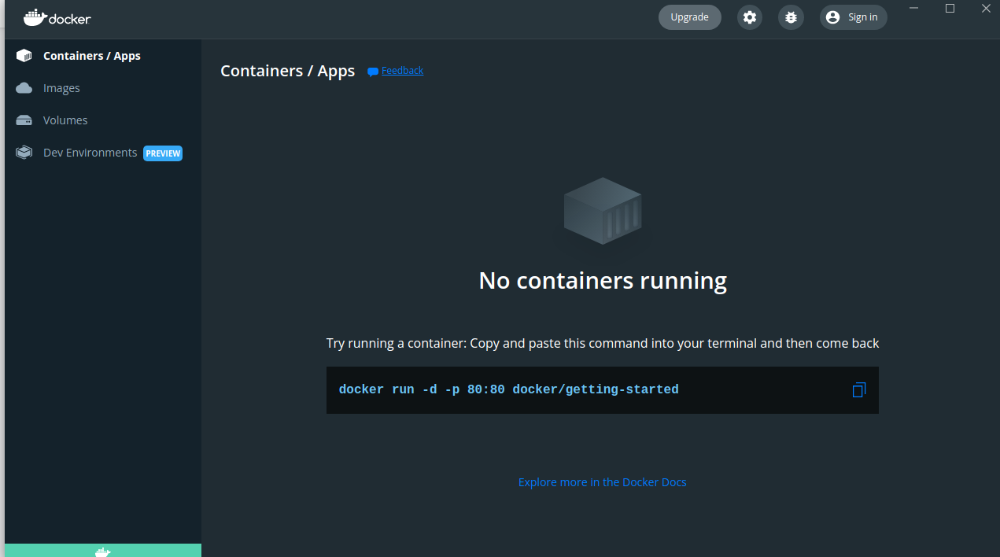
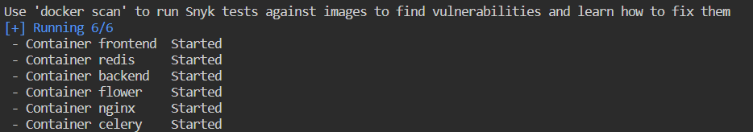
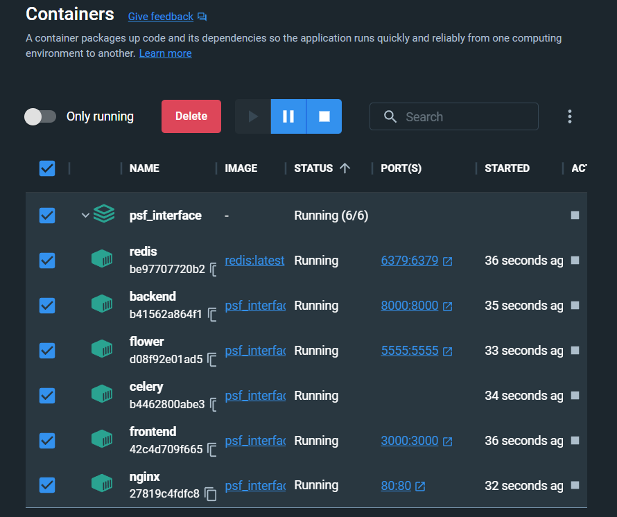
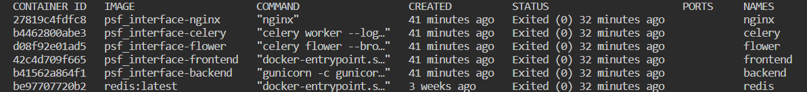
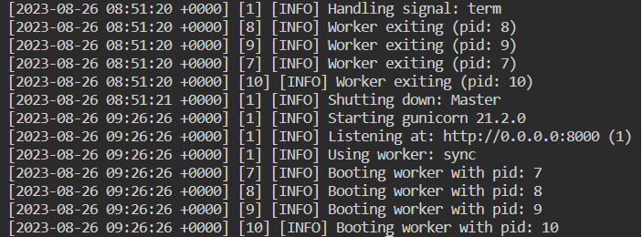

# Manual for installing and using Docker

- [Manual for installing and using Docker](#manual-for-installing-and-using-docker)
  - [Installation](#installation)
    - [Installation Docker Desktop](#installation-docker-desktop)
    - [Installation Docker Engine](#installation-docker-engine)
  - [Deploying Docker](#deploying-docker)
  - [Using Docker in the PSF interface](#using-docker-in-the-psf-interface)

## Installation

### Installation Docker Desktop

- Windows: <https://docs.docker.com/desktop/install/windows-install/>

  (Bedore installing Docker You need to install WSL. After installing You should reboot the PC: <https://docs.docker.com/desktop/wsl/>)
- Linux: <https://docs.docker.com/desktop/install/linux-install/>
- Mac: <https://docs.docker.com/desktop/install/mac-install/>

### Installation Docker Engine

- Linux: <https://docs.docker.com/engine/install/>

## Deploying Docker

The list of Docker commands:

1. To check that Docker is installed.

    ```bash
    docker version
    ```

2. To list all the running Docker containers.

    ```bash
    docker ps
    ```

3. To list all logs on the same Docker container

    ```bash
    docker logs <some container>
    ```

    Instead of `<some container>`, insert a specific running container (you can use `docker ps` for this) that you want to check.

4. To list all running Docker images on the system.

    ```bash
    docker images
    ```

## Using Docker in the PSF interface

1. `Installation and using`.
   When you [installed Docker](#installation-docker-desktop) (+ WSL if you have Windows), check that Docker is installed.
    If you're using Docker Desctop, you need to open this app.
    If everything is installed successfully, you will see this window.

    

2. `Running`.
   Then run one command:

    ```bash
    docker-compose up -d --build
    ```

    After the build, the console should have this:
    

    In Docker Desktop:
    

3. `Health check`. When the build is complete, check that the containers are running:

    ```bash
    docker ps
    ```
    Result:
    

    and there are no errors:

    ```bash
    docker logs backend
    ```    

    Result:
    

4. `Stopping the containers`.
   You can stop the containers on the Docker Desktop app or by entering the command:

    ```bash
    docker-compose stop
    ```    
